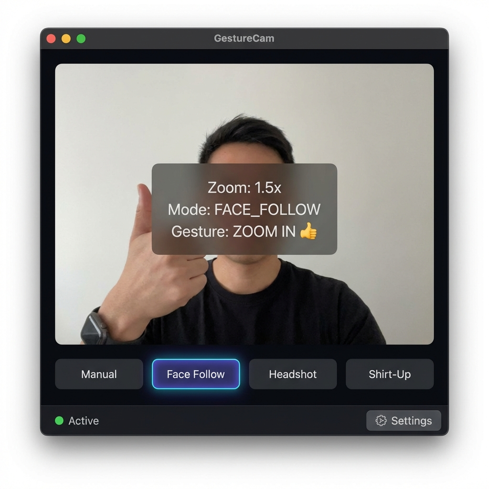

# GestureCam

<div align="center">


**Virtual Camera Controlled by Hand Gestures & Facial Expressions**

[](docs/assets/main_dashboard.png)

[Quick Start](#quick-start) · [Features](#features) · [Architecture](#architecture) · [Documentation](#documentation) · [Contributing](#contributing)

</div>

---

## Overview

**GestureCam** is an open-source computer vision platform that transforms your webcam into a smart virtual camera controlled by hand gestures and facial expressions. Built with MediaPipe and OpenCV, it provides seamless integration with OBS Studio, Zoom, Microsoft Teams, and other video conferencing platforms.

### Key Features

- **Hand Gesture Control**: Thumbs up/down (zoom), peace sign (pause), pinch (smooth zoom)
- **Face Tracking**: Automatic face framing with 468-landmark detection
- **Eye Blink Detection**: Quick actions via single/double blinks
- **Virtual Camera Output**: Direct OBS integration for streaming
- **AirCanvas Mode**: Draw in virtual space using hand gestures
- **Attendance System**: AI-powered facial recognition for attendance tracking
- **Dual UI**: Native desktop UI (Dear PyGui) + Web UI (NiceGUI)

---

## Quick Start

### Installation

```bash
# Clone the repository
git clone https://github.com/parkster127/gesturecam.git
cd gesturecam

# Create virtual environment
python3 -m venv venv
source venv/bin/activate  # On Windows: venv\Scripts\activate

# Install dependencies
pip install -r requirements.txt
```

### Run the Application

```bash
# Native UI (Recommended)
python3 main.py

# Or run directly
python3 -c "from gesturecam.ui.native_ui import run_demo; run_demo()"

# Web UI (Alternative)
python3 gesturecam/ui/web_ui.py
# Open http://localhost:8080
```

### Quick Demo

After launching, GestureCam will:
1. Detect your camera automatically
2. Download MediaPipe models on first run (stored in `~/.gesturecam/`)
3. Show you the control overlay
4. Enable virtual camera for OBS integration

---

## Features

### Gesture Controls

| Gesture | Action | Description |
|---------|--------|-------------|
| Thumbs Up | Zoom In | Increase zoom level |
| Thumbs Down | Zoom Out | Decrease zoom level |
| Peace Sign | Pause/Resume | Toggle gesture detection |
| Wink | Quick Zoom Burst | Temporary zoom in |
| Pinch (2 hands) | Smooth Zoom | Precise continuous zoom |

### Framing Modes

- **Manual**: Full control, no auto-tracking
- **Face Follow**: Smooth automatic face tracking
- **Headshot**: Frame on face/head area
- **Shirt-Up**: Frame from chest up

### Application Suite

GestureCam includes multiple applications:

1. **AI Camera Mode** - Main virtual camera with gesture control
2. **AirCanvas Mode** - Digital whiteboard controlled by hand gestures
3. **Attendance System** - Facial recognition for attendance tracking
4. **Benchmark Tool** - Performance testing and optimization

---

## Architecture

### Technology Stack

```
Frontend/UI:
  Dear PyGui  (Native Desktop UI)
  NiceGUI     (Web UI with FastAPI)

Computer Vision:
  MediaPipe   (Hand/Face Mesh Detection)
  OpenCV      (Camera Processing)
  NumPy       (Mathematical Operations)

Virtual Camera:
  pyvirtualcam (OBS Integration)

Core Logic:
  Python 3.10+
```

### Project Structure

```
gesturecam/
  gesturecam/
    camera/             # Camera abstraction & virtual camera
      operator.py       # Camera controller
      sources.py        # Camera source management
      virtualcam.py     # OBS integration
    core/               # Core computer vision logic
      zoom.py           # Zoom algorithms
      pipeline.py       # Processing pipeline
      framing.py        # Auto-framing logic
    vision/             # MediaPipe wrappers
      hands.py          # Hand detection
      face_mesh.py      # Face mesh detection (468 landmarks)
      gestures.py       # Gesture recognition
    ui/                 # User interfaces
      native_ui.py      # Dear PyGui desktop app
      web_ui.py         # NiceGUI web app
      theme.py          # Design system
      window.py         # Window management
    interactions/       # Gesture interactions
      drawing.py        # AirCanvas drawing
    apps/               # Additional applications
      air_canvas.py     # Digital whiteboard
    config.py           # Configuration management
    constants.py        # App constants
  attendance_system/    # Facial recognition attendance
    attendance_system.py
    user_registration.py
    analyze_attendance.py
  tests/                # Test suite
  docs/                 # Documentation
  main.py               # Application launcher
```

### Core Components

#### 1. Pipeline Architecture

```
Raw Camera Frame
    |
MediaPipe Detection (Hands/Face Mesh)
    |
Gesture Recognition
    |
Framing & Zoom Logic
    |
Virtual Camera Output -> OBS/Zoom/Teams
```

#### 2. Gesture Recognition Pipeline

```
Hand Landmarks (21 points per hand)
    |
Distance Calculations (pinch, thumb position)
    |
Gesture Classification (thumbs up/down, pinch)
    |
Action Dispatch (zoom in/out, pause, etc.)
```

#### 3. Face Tracking Pipeline

```
Face Detection
    |
Face Mesh (468 landmarks)
    |
Face Bounding Box Calculation
    |
Auto-framing Logic
    |
Smooth Camera Movement
```

### Design Principles

- **Modular Architecture**: Each component (camera, vision, UI, interactions) is independent
- **Zero-Copy Operations**: Minimize memory overhead with NumPy views
- **Smooth Motion**: Exponential smoothing for camera movements
- **Extensibility**: Easy to add new gestures, cameras, or output formats
- **Performance First**: Optimized for 30+ FPS on commodity hardware

---

## Documentation

- [Architecture](./docs/ARCHITECTURE.md) - System design and component overview
- [Features](./docs/FEATURES.md) - Complete feature reference
- [Contributing](./CONTRIBUTING.md) - How to contribute

---

## Configuration

GestureCam uses a configuration file at `~/.gesturecam/config.json`. Default settings:

```python
# gesturecam/config.py
@dataclass
class Config:
    CAMERA_INDEX: int = 0
    CAMERA_WIDTH: int = 1280
    CAMERA_HEIGHT: int = 720
    FPS: int = 30

    # Hand Tracking
    HAND_DETECTION_CONFIDENCE: float = 0.5
    MAX_HANDS: int = 2

    # Face Tracking
    FACE_DETECTION_CONFIDENCE: float = 0.5
    USE_FACE_MESH: bool = True

    # Zoom Settings
    MIN_ZOOM: float = 1.0
    MAX_ZOOM: float = 3.0

    # Virtual Camera
    VIRTUAL_CAM_ENABLED: bool = True
```

---

## Testing

```bash
# Run all tests
python -m pytest tests/

# Run with coverage
python -m pytest --cov=gesturecam tests/

# Run performance benchmark
python tests/benchmark_performance.py
```

---

## Development

### Setting up Development Environment

```bash
# Install dev dependencies
pip install -r requirements-dev.txt

# Pre-commit hooks
pre-commit install

# Run linting
ruff check gesturecam/
black gesturecam/
```

### Adding New Gestures

1. Define gesture logic in `gesturecam/vision/gestures.py`
2. Map gesture to action in `gesturecam/core/pipeline.py`
3. Update documentation

### Adding New UI Components

- For native UI: Modify `gesturecam/ui/native_ui.py`
- For web UI: Modify `gesturecam/ui/web_ui.py`
- Shared components: Add to `gesturecam/ui/theme.py`

---

## Contributing

We welcome contributions. Please see [CONTRIBUTING.md](./CONTRIBUTING.md) for guidelines.

### Ways to Contribute

- Report bugs
- Suggest new features
- Improve documentation
- Submit pull requests
- Add tests
- Help with translations

---

## License

This project is licensed under the **MIT License** - see the [LICENSE](./LICENSE) file for details.

---

## Acknowledgments

- **MediaPipe** by Google for the computer vision models
- **OpenCV** for camera handling and image processing
- **Dear PyGui** for the native desktop UI framework
- **NiceGUI** for the web UI framework
- All contributors who help improve GestureCam

---

## Project Stats

- **Lines of Code**: ~8,600
- **Python Files**: 30+
- **Test Coverage**: TBD
- **First Release**: 2024
- **License**: MIT

---

## Support & Community

- **Bug Reports**: [GitHub Issues](https://github.com/parkster127/gesturecam/issues)
- **Discussions**: [GitHub Discussions](https://github.com/parkster127/gesturecam/discussions)

---

## Roadmap

- [ ] Support for more gestures (fist, open palm, etc.)
- [ ] Multi-camera support
- [ ] Cloud-based gesture recognition
- [ ] Mobile app companion
- [ ] Plugin system for custom gestures
- [ ] Voice control integration
- [ ] Machine learning-based gesture optimization
- [ ] Real-time gesture statistics dashboard

---

<div align="center">

Made by the GestureCam Community

[Back to Top](#gesturecam)

</div>